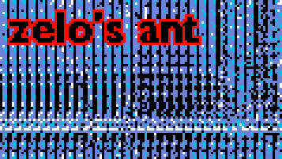
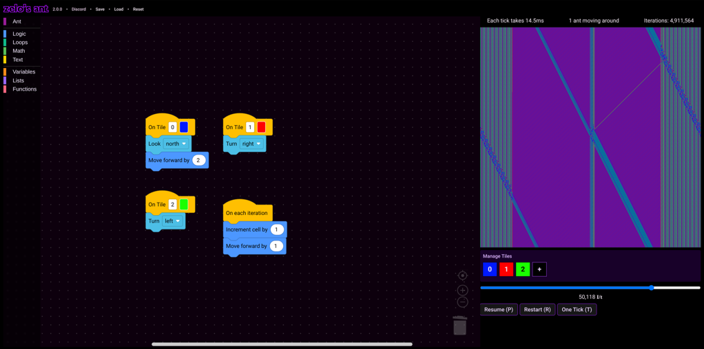

zelo's ant is an interactive Langton's ant simulator on the web. Create your own rules and see what patterns the ant makes.

## Features

- ⚡ **Fast**
    - Able to run **1 million** iterations under **300ms** using default rules.
    - Uses **WebGL2** for rendering.
- 💡 **Easy** to use
    - Block-based visual programming GUI (Like Scratch!).
    - Tooltips on every block.
    - Easy to save, load and share creations!
- 📋 Extremely **customizable** rules
    - Create your own rules for any tile.
    - Ability to change what the ant does every iteration.
