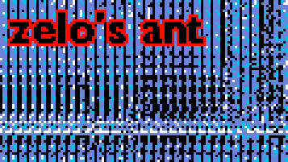

zelo's ant is an interactive Langton's ant simulator on the web. Create your own rules and see what patterns the ant(s) makes.

## Features

- ⚡ **Fast**
    - Able to run **1 million** iterations under **45ms** using default rules.
    - Uses **WebGL2** for rendering.
    - Option to use webassembly (even though it's slower, but it's there if you want it) (WIP).
- 💡 **Easy** to use
    - Visual programming GUI (Scratch-like).
    - Tooltips on every block. (WIP)
    - Easy to save and load creations!
- 📋 Extremely **customizable** rules
    - Able to create your own rules for any tile.
    - Ability to change what the ant does every iteration.
    - Ability to create more ants based on your own code.
