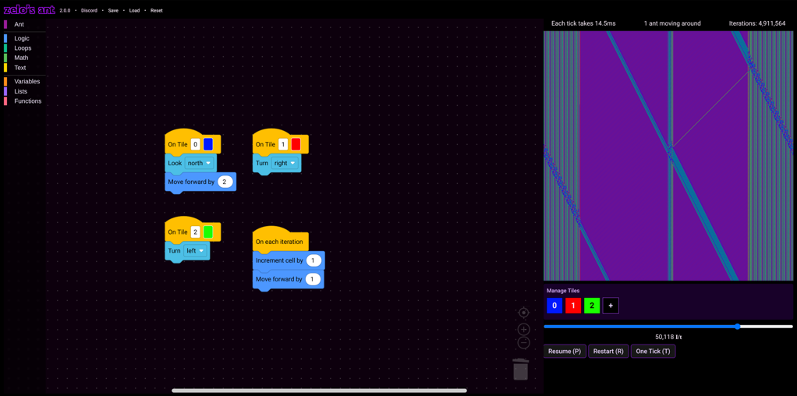

# 

**[zelo's ant](https://ant.zelo.dev)** is an interactive [Langton's ant](https://en.wikipedia.org/wiki/Langton%27s_ant) simulator on the web. Create your own rules and see what patterns the ant makes.

## What's the big deal with ants?

This simulator shows you how a simple set of rules can create complex patterns. One small edit and the result becomes completely different! It's also a great way to learn about cellular automata and emergent behavior.

In the future you'll also be able to explore rules made by other users.

## Tech Stack

- **Blockly** for the visual block editor
- **Netlify** for hosting
- **SvelteKit** as fullstack framework
- **Umami** for analytics
<!-- - **PocketBase** as online levels -->

## Contribute

zelo's ant is being actively developed by me, so if you have any suggestions, security concerns or find any bugs, feel free to open an issue or tell me in the [zelo.dev discord](https://discord.gg/um5KWabefm). Issues regarding accessibility are especially welcome, as I'm aiming for this project to be accessible in schools.
